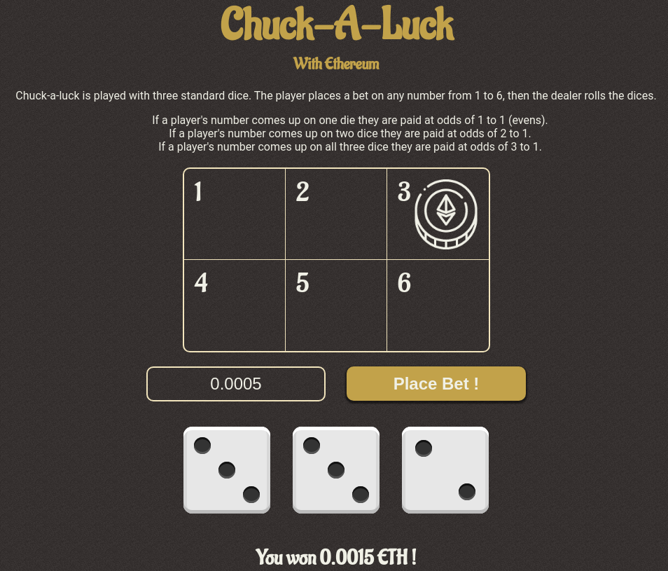

# Chuck A Luck with Ethereum 

This is a simple project I did while leaning the very basics of web3. I follow along the the course from [buildspace.so](https://buildspace.so/) and I was abbe to achieve this.

  

 

## Chuck A Luck the game

The game is very simple, the player chooses a number from 1-6 and set the bet amount in eth. After that 3 dices are rolled, depending on how many dices rolled the chosen number the bigger the prize. [Learn more here.](
https://en.wikipedia.org/wiki/Chuck-a-luck)

## Built With

* HardHat
* Vue
* Netlify
